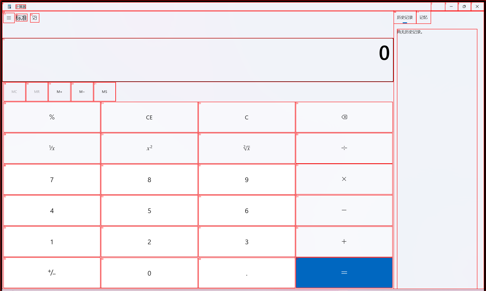

# PyWinAuto App 截图标注工具

这个工具使用 `pywinauto` 库连接到 Windows 应用程序，并截图标出所有的UI组件。

## 功能特性

- 🔍 **自动发现**: 列出当前运行的所有应用程序
- 🔗 **多种连接方式**: 支持通过窗口标题、进程ID或启动新程序连接
- 📸 **智能截图**: 自动截取应用程序窗口并标注所有UI组件
- 🎨 **彩色标注**: 不同类型的控件使用不同颜色标注
- 📋 **控件树**: 显示完整的控件层次结构
- 💾 **自动保存**: 截图自动保存到 `screenshots` 目录

## 安装依赖

```bash
pip install -r requirements.txt
```

## 使用方法

### 1. 交互模式（推荐）

```bash
python app_coor.py
```

然后按照菜单提示操作：

1. **列出运行中的应用程序** - 查看当前所有打开的窗口(窗口标题, 类名, 进程ID)
2. **连接到应用程序** - 通过不同方式连接到目标应用(窗口标题, 进程ID, 应用程序路径)
3. **截图并标注控件** - 对连接的应用进行截图和标注
4. **打印控件树** - 查看应用的控件层次结构
5. **启动计算器(示例)** - 快速演示功能

### 2. 命令行模式

```bash
python app_coor.py "窗口标题"
```

例如：
```bash
python app_coor.py "计算器"
python app_coor.py "记事本"
```

## 输出说明

### 计算器标注 example


### 截图标注
- 每个控件会用彩色边框标注
- 控件编号显示在左上角
- 不同类型控件使用不同颜色：
  - 🔴 **红色**: 按钮 (Button)
  - 🔵 **蓝色**: 输入框 (Edit)
  - 🟢 **绿色**: 静态文本 (Static)
  - 🟣 **紫色**: 列表框 (ListBox)
  - 🟠 **橙色**: 下拉框 (ComboBox)
  - 🟤 **棕色**: 树形控件 (TreeView)
  - 🩷 **粉色**: 标签页 (TabControl)
  - 🟡 **红色**: 默认控件 (Default)

### 控件信息
每个控件会显示：
- 编号
- 控件类型
- 文本内容
- 位置坐标 (x1, y1, x2, y2)

### 控件树结构
显示控件的层次关系，使用缩进表示父子关系。

## 支持的应用程序类型

- Windows 原生应用程序
- WPF 应用程序
- Windows Forms 应用程序
- 部分 UWP 应用程序
- 基于 Win32 的应用程序

## 注意事项

1. **管理员权限**: 某些系统应用可能需要管理员权限才能访问
2. **应用程序状态**: 确保目标应用程序处于可见状态
3. **截图质量**: 建议在截图前将目标窗口置于前台
4. **兼容性**: 支持 Windows 7 及以上版本

## 常见问题

### Q: 连接失败怎么办？
A: 
- 确保目标应用程序正在运行
- 尝试使用不同的连接方式
- 检查是否需要管理员权限

### Q: 截图为空或不完整？
A: 
- 确保窗口没有被遮挡
- 等待应用程序完全加载后再截图
- 检查窗口是否最小化

### Q: 找不到某些控件？
A: 
- 某些控件可能是动态生成的
- 尝试与应用程序交互后再次获取控件
- 部分自定义控件可能无法被识别

## 示例用途

- **UI自动化测试**: 分析应用程序的UI结构
- **可访问性测试**: 检查控件的可访问性属性
- **逆向工程**: 了解应用程序的界面组成
- **文档制作**: 为应用程序创建UI说明文档

## 文件结构

```
项目目录/
├── app_coor.py              # 主程序文件
├── requirements.txt         # 依赖列表
├── README.md # 使用说明
└── screenshots/             # 截图保存目录（自动创建）
    ├── 应用名称_时间戳.png
    └── ...
``` 
